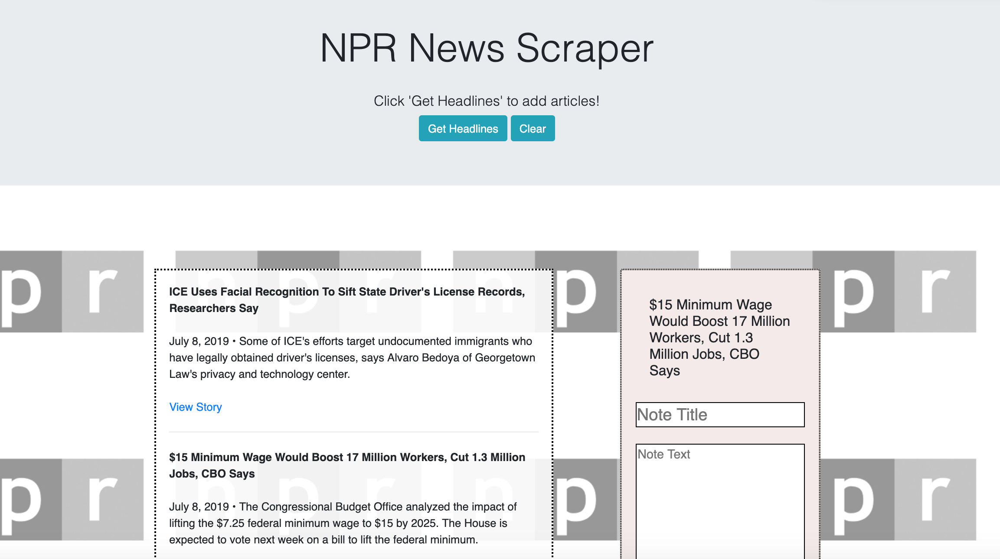

# news-scraper

## About
A web scraper application developed using MongoDB and Node. Users can scrape recent news articles from NPR News grabbing the headlines, direct links and a brief description of each story. Users also have the ability to make notes on each article which are saved on the database. Users can clear headlines and scrape for new headlines as well. Application is deployed on Heroku using persistent storage with a Mongo database.



## Getting Started

These instructions will get you a copy of the project up and running on your local machine for development and testing purposes.

### Installation

If you are cloning/downloading the GitHub repo, please be sure to use the package manager [NPM](https://www.npmjs.com/) to install the needed packages for the project to run through node and express:

```bash
NPM dependencies:
    "axios": "^0.18.0",
    "cheerio": "^1.0.0-rc.3",
    "dotenv": "^8.0.0",
    "express": "^4.17.1",
    "express-handlebars": "^3.1.0",
    "mongoose": "^5.5.11",
    "morgan": "^1.9.1"
```
This can be done by running the below code for each dependency

```bash
npm install [program]
```

or you can simply run the below:

```bash
npm i
```

## How to run the program

The application is hosted through heroku and is available at the below link.

https://protected-ridge-24325.herokuapp.com/

## Technology
- MongoDB, Mongoose, Cheerio, Node, Express, Morgan, Ajax, Javascript

## Contributing Guidelines
All contributions and suggestions are welcome! For direct contributions, please fork the repository and file a pull request.

## Contributors
@bwillstorey

## Contact
#### Developer/Full-stack Web Software Developer
- Homepage: https://brianstorey.me 
- email: bwillstorey@gmail.com
- LinkedIn: https://www.linkedin.com/in/brianstorey/